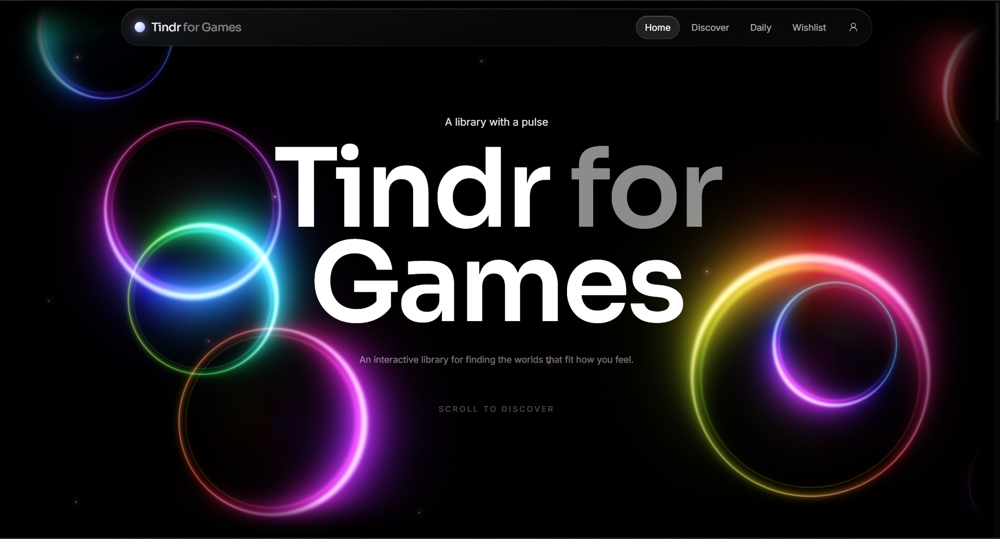
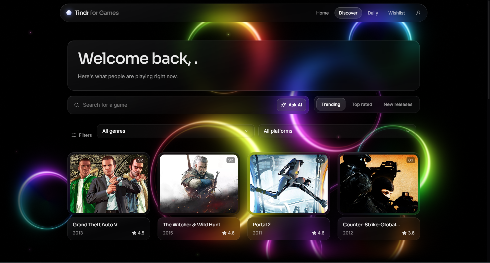
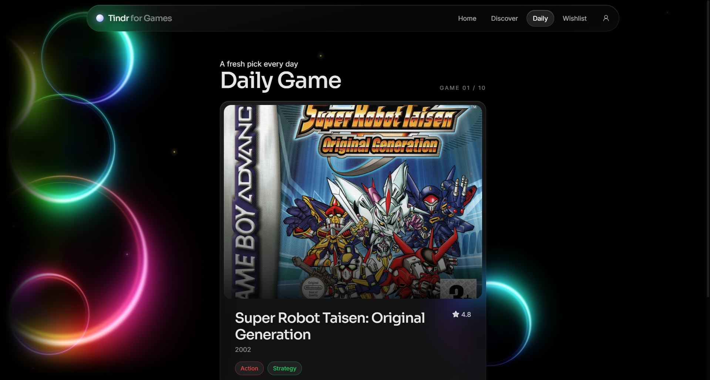
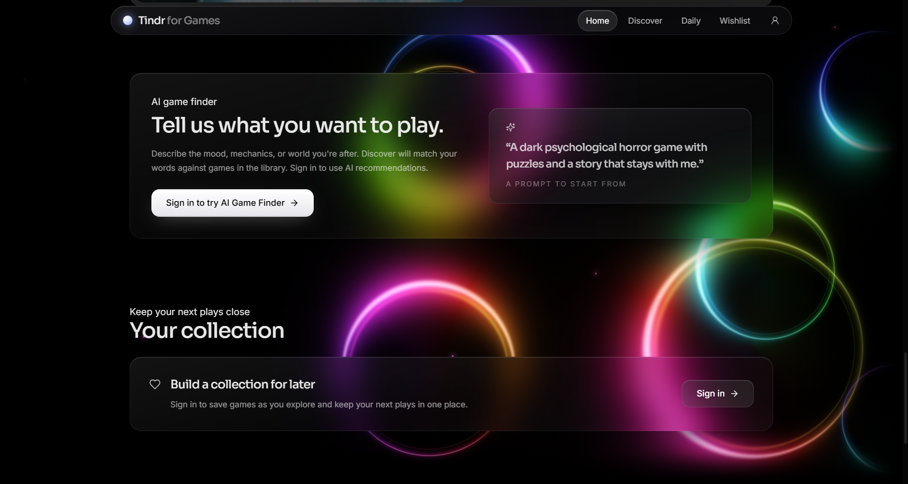
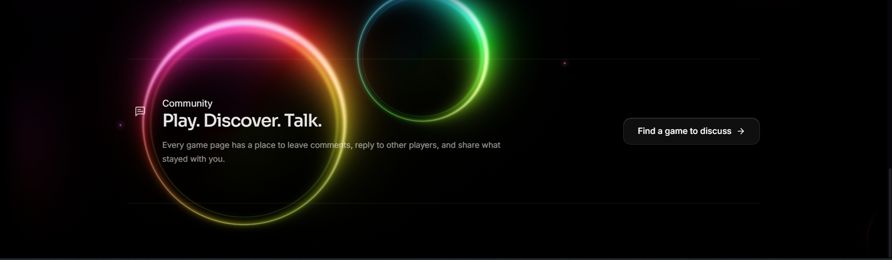

# Tindr for Games

A full-stack game discovery and social platform built around a simple idea: finding your next game should feel more personal than browsing a list of titles.

Players can discover real games, search and filter the catalog, build a wishlist, explore a daily selection, discuss games with other players, and describe what they want to play in natural language through Tindr AI.

**Live:** [tindr-for-games.vercel.app](https://tindr-for-games.vercel.app/)

---

## What is Tindr for Games?

Tindr for Games is a portfolio project built as a complete web application rather than a simple CRUD demo.

The project brings together:

- real game data from external providers
- a normalized PostgreSQL game catalog
- authentication and user profiles
- wishlist-based recommendations
- a deterministic Daily Game experience
- natural-language AI recommendations
- comments, replies, and likes
- a responsive, premium dark UI
- automated validation through GitHub Actions
- separate production deployments for the frontend, API, and database

The application is intentionally built as a **modular monolith**. The goal was to keep the architecture understandable and maintainable while still separating the major responsibilities of the system.

---

## Screenshots

### Home

The landing experience introduces the product with the visual identity of Tindr for Games and leads into the discovery experience.

<p align="center">
  
</p>

### Discover

The Discover page works with real game data and provides search, genre/platform filtering, and different discovery views.

<p align="center">
  
</p>

### Daily Game

Daily Game creates a small discovery deck from games already stored in the application's catalog.

<p align="center">
  
</p>

### AI Game Finder and Collection

The application also has an AI-assisted discovery flow and a personal collection/wishlist area.

<p align="center">
  
</p>

### Community

Game pages include a discussion area where players can leave comments and reply to other players.

<p align="center">
  
</p>

---

## Core features

### Game discovery

Players can:

- browse games
- search by name
- filter by genre
- filter by platform
- explore trending games
- explore top-rated games
- explore new releases
- open game details
- view ratings, release information, genres, platforms, and screenshots

The application does not rely on a manually maintained list of thousands of games. External game data is fetched through the backend, normalized, and persisted in PostgreSQL.

### Personalized recommendations

Recommendations use information already available inside the application.

For authenticated users, wishlist genres are used to find games that share those preferences. Candidates are then ranked using deterministic database logic.

This keeps the recommendation system understandable and reproducible instead of hiding the entire decision inside an external service.

### Tindr AI

Players can describe what they want to play in natural language.

For example:

> I want a dark psychological horror game with puzzles and a story that stays with me.

The flow is:

```text
Natural-language request
        ↓
Gemini
        ↓
Structured preferences
        ↓
Database search
        ↓
Candidate ranking
        ↓
Real games from the catalog
```

Gemini is used to understand the request. It is **not** the source of truth for the game catalog.

The backend remains responsible for finding and ranking games that actually exist in the application's database.

### Daily Game

The Daily Game gives players a small discovery deck without requiring a separate external service for every card.

The backend considers signals such as:

- the user's identity genre
- genres represented in the wishlist
- ratings and popularity
- release recency
- general discovery candidates

For authenticated users, games already in their wishlist are excluded.

The selection is generated from local PostgreSQL data and uses deterministic ordering so the backend does not need to store swipe history for this feature.

### Wishlist

Players can save games they want to keep track of.

Wishlist entries are associated with the authenticated user and protected by a database uniqueness constraint so the same game cannot be saved twice by the same user.

### Community discussions

Game pages support:

- comments
- threaded replies
- comment likes
- editing your own comments
- deleting your own comments

The API handles authorization so users cannot modify another user's comments.

### Genre identity

Every user can choose an identity genre.

Each genre maps to a visual color used by the application to give the user's profile and activity a recognizable identity.

```text
Horror     → Purple
Action     → Red
Adventure  → Blue
RPG        → Gold
Strategy   → Green
Indie      → Pink
```

The mapping is centralized in the backend rather than duplicated throughout the UI.

---

## Architecture

```text
                         ┌─────────────────────┐
                         │       Vercel        │
                         │   React + Vite      │
                         └──────────┬──────────┘
                                    │
                              HTTP / JSON
                                    │
                                    ▼
                         ┌─────────────────────┐
                         │       Render        │
                         │    FastAPI API      │
                         └──────────┬──────────┘
                                    │
                ┌───────────────────┼───────────────────┐
                │                   │                   │
                ▼                   ▼                   ▼
        ┌──────────────┐    ┌──────────────┐    ┌──────────────┐
        │     Neon     │    │ Game Providers│    │    Gemini    │
        │  PostgreSQL  │    │              │    │     AI       │
        └──────────────┘    └──────┬───────┘    └──────────────┘
                                   │
                              ┌────┴────┐
                              │         │
                             RAWG      Steam
```

The browser communicates with the FastAPI API.

External providers are accessed by the backend rather than directly from the browser. This keeps provider credentials private and gives the application one place to normalize and validate external data.

---

## Backend architecture

The backend follows a simple request flow:

```text
Router
  ↓
Service
  ↓
Provider / Database
  ↓
Response
```

The main areas are:

```text
backend/
├── app/
│   ├── auth/
│   ├── models/
│   ├── providers/
│   │   ├── ai/
│   │   └── games/
│   ├── routers/
│   ├── services/
│   ├── database.py
│   └── main.py
│
├── alembic/
└── requirements.txt
```

Routers deal with HTTP requests, services contain application logic, providers isolate external integrations, and SQLAlchemy models represent persisted data.

---

## Frontend architecture

The frontend is a React + TypeScript Vite application.

```text
frontend/
├── src/
│   ├── api/
│   │   ├── client.ts
│   │   ├── index.ts
│   │   └── mock.ts
│   ├── components/
│   ├── context/
│   ├── pages/
│   ├── App.tsx
│   ├── main.tsx
│   └── types.ts
├── public/
├── package.json
└── vite.config.ts
```

The frontend uses a shared API layer instead of spreading HTTP calls throughout individual pages.

It also supports a mock-data mode for UI development when the backend is not running.

---

## Game data pipeline

Tindr for Games uses provider abstractions for game data.

```text
Game Router
     ↓
Game Service
     ↓
Game Provider
     ├── RAWG Provider
     └── Steam Provider
```

External responses are normalized before being stored.

A normalized game can contain:

- external provider ID
- provider name
- title and slug
- description
- release date
- rating
- rating count
- Metacritic score
- cover image
- background image
- screenshots
- genres
- platforms

This gives the rest of the application a stable game model instead of coupling every feature to a provider's response format.

---

## Database

PostgreSQL is the primary application database.

The main entities include:

```text
users
games
genres
platforms
wishlists
comments
comment_likes
game_genres
game_platforms
```

Many-to-many game relationships are represented through association tables:

```text
games ─────< game_genres >───── genres

games ───< game_platforms >──── platforms
```

Wishlist entries use a unique constraint on:

```text
(user_id, game_id)
```

so duplicate wishlist entries are prevented at the database level.

Alembic manages schema changes and keeps the deployed database synchronized with the application's migration history.

---

## Authentication and security

Authentication is handled by the FastAPI backend.

The application uses:

- Argon2 password hashing
- JWT access tokens
- HTTP-only cookies
- configurable token expiration
- configurable SameSite cookie policy
- secure cookies in production
- CORS origin allowlisting
- authenticated route dependencies
- database-level uniqueness constraints

The frontend does not store authentication tokens in local storage.

For the production deployment, the frontend is hosted on Vercel and the API on Render, so cross-site cookie configuration is enabled for authentication.

---

## Technology stack

### Frontend

- React
- TypeScript
- Vite
- Tailwind CSS
- React Router
- Framer Motion
- Lucide

### Backend

- Python
- FastAPI
- SQLAlchemy 2
- Pydantic
- Alembic
- PyJWT
- pwdlib
- Argon2

### Database

- PostgreSQL
- Neon PostgreSQL in production

### External services

- RAWG — game metadata
- Steam — Steam-specific game information
- Google Gemini — natural-language preference extraction

### Development and deployment

- Git
- GitHub
- GitHub Actions
- Docker
- Vercel
- Render
- Neon

---

## Why a modular monolith?

The project deliberately does not use microservices.

For the current scale, splitting authentication, games, recommendations, comments, and AI into separately deployed services would introduce infrastructure and operational complexity without solving a current problem.

Instead, the backend is organized into modules with clear responsibilities.

The project also deliberately avoids infrastructure such as:

- Redis
- Celery
- Kubernetes
- MongoDB
- Elasticsearch
- WebSockets
- vector databases
- LangChain
- separate AI microservices

These are not inherently bad technologies. They simply were not necessary for the current product.

The architecture can evolve if the requirements eventually justify them.

---

## Running locally

### Requirements

You will need:

- Python 3.12+
- Node.js
- npm
- Docker Desktop
- a RAWG API key for game-data features
- a Gemini API key for AI recommendations

### 1. Clone the repository

```bash
git clone https://github.com/Qasim-2357/tindr-for-games.git
cd tindr-for-games
```

### 2. Configure the backend

Copy the environment template:

```bash
cp .env.example .env
```

Set the required values:

```env
RAWG_API_KEY=
GEMINI_API_KEY=
JWT_SECRET_KEY=
```

The included PostgreSQL settings are intended for local development.

### 3. Start PostgreSQL

```bash
docker compose up -d db
```

### 4. Set up the backend

```bash
cd backend
python -m venv venv
```

Git Bash:

```bash
source venv/Scripts/activate
```

Install dependencies:

```bash
pip install -r requirements.txt
```

Run migrations:

```bash
alembic upgrade head
```

Start FastAPI:

```bash
uvicorn app.main:app --reload --port 8000
```

The API will be available at:

```text
http://127.0.0.1:8000
```

FastAPI's interactive documentation is available at:

```text
http://127.0.0.1:8000/docs
```

### 5. Start the frontend

Open another terminal:

```bash
cd frontend
npm ci
npm run dev
```

The frontend runs at:

```text
http://localhost:3000
```

Set `VITE_API_URL` in `frontend/.env` if the backend is running somewhere other than the default local URL.

### Frontend mock mode

For UI-only development:

```bash
VITE_MOCK=true npm run dev
```

On PowerShell:

```powershell
$env:VITE_MOCK='true'
npm run dev
```

Mock data is intended for local frontend development only.

---

## Environment variables

### Backend

The root `.env` supports:

```env
DATABASE_URL=

POSTGRES_DB=
POSTGRES_USER=
POSTGRES_PASSWORD=
POSTGRES_PORT=

RAWG_API_KEY=
GEMINI_API_KEY=

JWT_SECRET_KEY=
JWT_EXPIRE_MINUTES=30

AUTH_COOKIE_SECURE=false
AUTH_COOKIE_SAMESITE=lax
CORS_ORIGINS=
```

`DATABASE_URL` is used by production deployments. The `POSTGRES_*` variables provide the local PostgreSQL configuration.

### Frontend

```env
VITE_API_URL=http://localhost:8000
```

Never put backend secrets in `VITE_*` variables because Vite environment variables with that prefix are exposed to the client bundle.

---

## Deployment

The production application is split into three parts:

| Part | Platform |
|---|---|
| Frontend | Vercel |
| FastAPI backend | Render |
| PostgreSQL | Neon |

GitHub is used for source control and GitHub Actions provides automated validation.

Production secrets and environment-specific configuration are stored in the deployment platforms rather than committed to the repository.

**Live application:** [tindr-for-games.vercel.app](https://tindr-for-games.vercel.app/)

---

## Testing and validation

The project includes automated checks intended to catch problems before deployment.

Validation includes:

- backend tests
- application import checks
- frontend production builds
- Alembic migration checks
- database schema verification
- Git diff validation
- GitHub Actions CI

The production database is migrated through Alembic rather than being manually modified.

---

## Engineering decisions

### Keep external APIs behind the backend

The frontend does not call RAWG or other providers directly.

This keeps API credentials private and gives the application control over normalization, validation, and provider changes.

### Keep AI away from the source of truth

Gemini is used to understand a player's natural-language request.

It does not decide whether a game exists.

The PostgreSQL catalog remains the source of truth, while the backend controls candidate selection and ranking.

### Normalize external game data

External APIs have their own response structures.

Persisting normalized data gives the rest of the application one consistent game model.

### Use database constraints as well as application checks

Important invariants are enforced at the database level where appropriate.

For example, a user/game pair can only appear once in the wishlist.

### Prefer simple architecture until complexity is justified

The project uses infrastructure that solves actual requirements instead of adding technologies simply because they are popular.

If future requirements demand caching, background jobs, real-time features, search infrastructure, or more sophisticated recommendation models, those can be introduced when there is a concrete reason for them.

---

## Project status

Tindr for Games is deployed and the core application is operational.

Current functionality includes:

- game discovery
- search and filtering
- game details
- wishlist
- personalized recommendations
- Daily Game
- AI Game Finder
- authentication
- genre identity
- comments and replies
- comment likes
- PostgreSQL persistence
- external game-data integration
- automated CI validation

The project is primarily a portfolio and learning project, with an emphasis on understanding the engineering decisions behind the application rather than simply assembling a collection of frameworks.

---

## License

This is a personal portfolio project.
